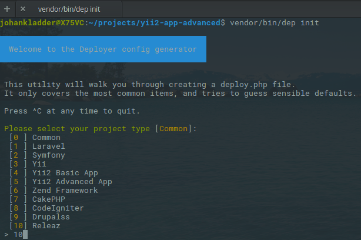

# Opzetten van de Deployer
- Zorg ervoor dat je SSH toegang hebt naar de deployment server. Zie [hier]() voor meer.
- Download / installeer [composer]() als dit nog niet beschikbaar is binnen het project.
- Installeer de deployer als een development dependency d.m.v. : 
  - `php composer.phar require releaz/deployer ~[version] --dev`
- De deployer is vanaf nu beschikbaar vanuit je vendor map. Doordat het gebruik maakt van [Deployer]() 
kun je de deployer gewoon starten d.m.v. :
   - `vendor/bin/dep [action]`
   
# Het initialiseren van een een deploybare applicaties:
- Zorg ervoor dat het bovenstaande geinstalleerd is;
- Daarna, voer `vendor/bin/dep init` uit.
- Kies de 'Releaz' template voor Yii2 applicaties

- Volg de stappen.
- Wanneer alles goed is gegaan, worden er twee bestanden aangemaakt: `deploy.php` en deploy-config.yml.example

# Gegenereerde bestanden
Tijdens het initialisatieproces zijn er twee bestanden aangemaakt. Deze bestanden 
hebben de volgende werking. 

### deploy.php
Dit bestand is de kern van de deployer. Het bestand is geoptimaliseerd voor het laden van 
gegeven configuraties. Hierop staan geen zogenoemde 'secrets' en kan dus gerust meegepushed 
worden naar de repository.

### deploy-config.yml.example
Dit bestand is een voorbeeld bestand van de deployment configuratie. Dit bestand kan worden 
overgenomen en naar eigen inbreng worden ingevuld.

[Ga naar configuratie](configuration)